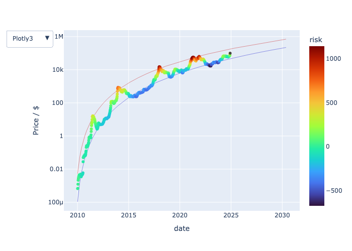
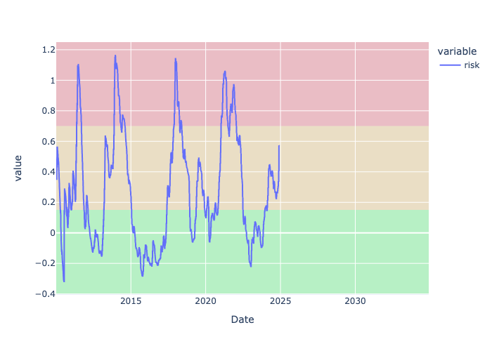
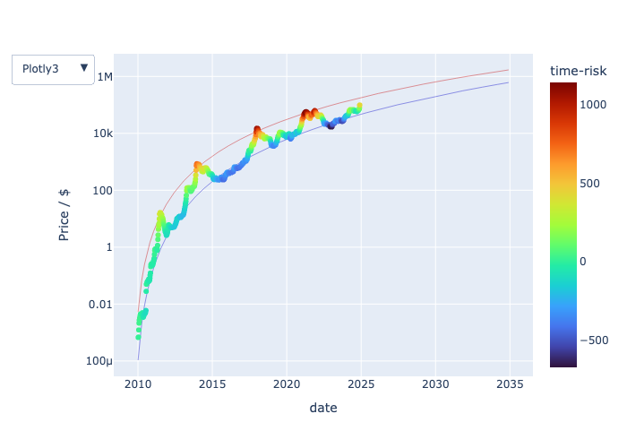
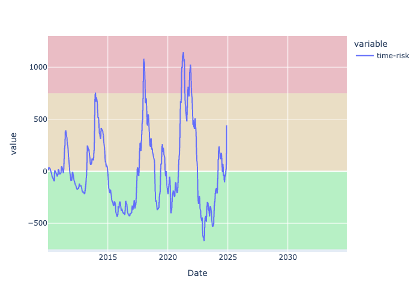

# Bitcoin Risk Metric

This Python package provides a simple risk metric for the BTC/USD pair based on logarithmic polynomial regression. Under the assumption that the BTC/USD pair follows polylogarithmic growth, it provides an estimate for the risk as a function of time and price.

## Results

The main result of this repo is the [Bitcoin risk dashboard](https://roman-ellerbrock.github.io/bitcoin_risk/index.html).

Here're a snapshow of the results:

[Bitcoin-price colored by risk](https://roman-ellerbrock.github.io/bitcoin_risk/btc.html)

[Valuation-based Bitcoin risk](https://roman-ellerbrock.github.io/bitcoin_risk/risk.html)

[Bitcoin-price colored by time-risk](https://roman-ellerbrock.github.io/bitcoin_risk/btc_time.html)

[Time-based Bitcoin risk](https://roman-ellerbrock.github.io/bitcoin_risk/timerisk.html)

## Installation

To install the package, you can use pip:

pip install git+https://github.com/roman-ellerbrock/bitcoin_risk

## Contributing

If you would like to contribute to this project, please fork the repository and submit a pull request. Any contributions are welcome!

## License

This project is licensed under the LGPL License - see the [LICENSE](LICENSE) file for details.